  
  <!-- FIXED: Width increased to 500 to stop text cutting off. Updated text options. -->
  

<!-- Interactive Table: Passport + Neural Network (Left) | Info (Right) -->
<table align="center" width="100%" style="border: none;">
  <tr>
    <!-- LEFT COLUMN: VISUALS -->
    <td width="50%" align="center" valign="top" style="border: none;">
       
       <!-- 1. THE ML PASSPORT CARD -->
       <!-- Link this to the file you just created -->
       
       
         

       <!-- 2. THE NEURAL NETWORK ANIMATION -->
       
    </td>

    <!-- RIGHT COLUMN: CONTENT -->
    <td width="50%" align="left" valign="top" style="border: none;">
      <h3>👩‍💻 About Me</h3>
      

        I am a <b>Machine Learning Engineer</b> blending algorithmic precision with creative system design.
      

      <ul>
         <li>🎓 <b>B.Tech Student</b> at <a href="https://jcboseust.ac.in">J.C. Bose UST</a> (2022-2026)</li>
         <li>🤖 <b>Core Focus:</b> Natural Language Processing (NLP), Multimodal AI, and Scalable Model Deployment.</li>
         <li>🚀 <b>Goal:</b> Bridging the gap between complex data models and human-centric applications.</li>
         <li>🏆 <b>Google Girl Hackathon '24</b> (Round 2)</li>
         <li>💻 <b>Open Source:</b> GSSoC '24 Contributor</li>
         <li>🎖️ <b>Senior Coordinator</b> at UCC & DAC, YMCA</li>
      </ul>
      

        
        
      

      
      <h3>🛠️ Tech Arsenal</h3>
      
      <!-- Compact Badge Layout -->
      

        <b>Languages:</b> 
        
        
        
      

      

        <b>AI & ML:</b> 
        
        
        
        
      

      

        <b>Dev & Tools:</b> 
        
        
        
        
      

    </td>
  </tr>
</table>

   
  <!-- Stats Section: Using Midnight-D theme to match dark/pink vibe -->
  
  
  
    
  
  <!-- Snake Animation Placeholder (If you set up the action) -->
  

